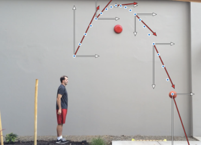

PhysicAI
==============================

DSR Batch 30 portfolio project: Identify, analyze and visualize physical-mechanical processes in videos.

Summary
------------
Existing software for educational purposes in mechanics lack of one crutial feature: there is no (state of the art) object detection. Teachers need to mark the position for each image by hand, which is very time-consuming and tedious. 

There are already many tools for object identification and object tracking in videos. There are also methods for trajectory prediction and physics simulation. I want to use these tools together with machine learning algorithms to analyse and visiualize the underlying physical laws (equations of motions) by extracting characteristics like position, velocity, acceleration, spin, impulse, energy, friction and forces.

To this end, the tools Yolo and MuJoCo might be useful:
* **MuJoCo**: Create artificial but realistic videos of (simple) well defined physical processes as trainings data
* **Yolo**: Object identification and object tracking in videos 
* Classification: Identify the physical process 
* Prediction: Estimation of physical parameters 
* Forecast: Build and run a model in MuJoCo based on the recognized object(s) and parameters 

Further Considerations and Explanations
------------

*t.b.d*

Roadmap and Milestones
------------
### 1. Basic:
- Use object detection in videos to generate graphs of
     - Position (x, y)
     - Velocity (v = (dx/dt, dy/dt))
     - Acceleration (a = dv/dt)
- Create trainsdata with *MuJoCo* and train a object tracking model on it to:
    - Estimate physical parameters
        - Position, velocity, acceleration
        - Rotation *(let's see if this works ... )*
        - Forces, impluse and energy (therefore, we need to know or to estimate the *mass*)
    - Classification of movement, i.e. is the object
        - Hinged (pendulum)
        - Rotating
        - Moving
            - Uniform
            - Accelerated
- Object detection in short and simple videos for educational purposes, i.e. basket ball, pendulum, … 

### 2. Advanced: 
- Adaption of non-optimal camera position / movement
    - Automatically finding best coordinate system 
    - Detecting horizontal / vertical edges, surfaces, ... 
    - Filter out observers movememts        
- Application on real life data
    - Analyse selfmade videos
    - Analyse action scenes from movies
- Decomposition of complex movement in simpler parts
    - Flying = uniform + accelerated
    - Bouncing Ball = mirrored + energy loss 
- Create and run MuJoCo model from analyzed visual data
    - Create predictions
    - Continue videos
    - Track obfuscated objects

### Ambitious / Perspective: 

- Combination with pose detection
    - Forces acting on the limbs
    - Prediction of limb movement

- Change physics in the virtual model to 
    - relativistic
    - zero gravity
    - ...

Project Organization
------------

    ├── LICENSE
    ├── Makefile           <- Makefile with commands like `make data` or `make train`
    ├── README.md          <- The top-level README for developers using this project.
    ├── data
    │   ├── external       <- Data from third party sources.
    │   ├── interim        <- Intermediate data that has been transformed.
    │   ├── processed      <- The final, canonical data sets for modeling.
    │   └── raw            <- The original, immutable data dump.
    │
    ├── docs               <- A default Sphinx project; see sphinx-doc.org for details
    │
    ├── models             <- Trained and serialized models, model predictions, or model summaries
    │
    ├── notebooks          <- Jupyter notebooks. Naming convention is a number (for ordering),
    │                         the creator's initials, and a short `-` delimited description, e.g.
    │                         `1.0-jqp-initial-data-exploration`.
    │
    ├── references         <- Data dictionaries, manuals, and all other explanatory materials.
    │
    ├── reports            <- Generated analysis as HTML, PDF, LaTeX, etc.
    │   └── figures        <- Generated graphics and figures to be used in reporting
    │
    ├── requirements.txt   <- The requirements file for reproducing the analysis environment, e.g.
    │                         generated with `pip freeze > requirements.txt`
    │
    ├── setup.py           <- makes project pip installable (pip install -e .) so src can be imported
    ├── src                <- Source code for use in this project.
    │   ├── __init__.py    <- Makes src a Python module
    │   │
    │   ├── data           <- Scripts to download or generate data
    │   │   └── make_dataset.py
    │   │
    │   ├── features       <- Scripts to turn raw data into features for modeling
    │   │   └── build_features.py
    │   │
    │   ├── models         <- Scripts to train models and then use trained models to make
    │   │   │                 predictions
    │   │   ├── predict_model.py
    │   │   └── train_model.py
    │   │
    │   └── visualization  <- Scripts to create exploratory and results oriented visualizations
    │       └── visualize.py
    │
    └── tox.ini            <- tox file with settings for running tox; see tox.readthedocs.io

--------

<small>Project based on the <a target="_blank" href="https://drivendata.github.io/cookiecutter-data-science/">cookiecutter data science project template</a>. #cookiecutterdatascience</small>

